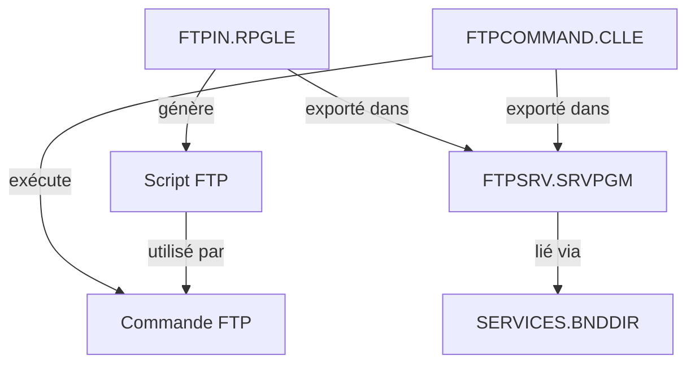

# Plan d'Amélioration du Projet ftpservices

## 📋 Vue d'ensemble du projet actuel

### Architecture actuelle
Le projet ftpservices est une bibliothèque IBM i qui fournit des services FTP de base :



**Composants principaux:**
- [`FTPIN.RPGLE`](SOURCES/FTPIN.RPGLE:1) - Module de génération de scripts FTP (PUT uniquement)
- [`FTPCOMMAND.CLLE`](SOURCES/FTPCOMMAND.CLLE:1) - Programme CL d'exécution FTP
- [`FTPSRV.SRVPGM`](SOURCES/FTPSRV.BND:1) - Service program exportant les fonctions
- Dépendance: logfori (système de logging)

### Fonctionnalités actuelles
- ✅ Transfert PUT de fichiers vers serveur FTP
- ✅ Authentification basique (user/password)
- ✅ Mode binaire
- ✅ Navigation dans les répertoires (cd/lcd)

---

## 🔒 1. AMÉLIORATIONS DE SÉCURITÉ (Priorité: CRITIQUE)

### 1.1 Gestion sécurisée des mots de passe

**Problème actuel:**
```rpgle
// Ligne 40 de FTPIN.RPGLE - Mot de passe en clair dans le fichier
srcdta = %trimr(l_USER) + ' ' + l_MDP;
```

**Améliorations recommandées:**
- [ ] Utiliser des variables cryptées pour les mots de passe
- [ ] Implémenter un système de coffre-fort (vault) pour les credentials
- [ ] Ajouter support pour clés SSH/SFTP au lieu de FTP classique
- [ ] Masquer les mots de passe dans les logs et traces
- [ ] Limiter la longueur des paramètres password à des valeurs sécurisées

**Impact:** 🔴 CRITIQUE - Sécurité des données sensibles

### 1.2 Validation des entrées

**Problèmes actuels:**
- Aucune validation des chemins (risque d'injection)
- Aucune vérification de la longueur des paramètres
- Pas de sanitization des noms de fichiers

**Améliorations recommandées:**
- [ ] Valider tous les chemins d'accès (origine/destination)
- [ ] Vérifier les caractères spéciaux dans les noms de fichiers
- [ ] Implémenter une whitelist de caractères autorisés
- [ ] Ajouter des limites de longueur strictes
- [ ] Protéger contre les attaques par traversée de répertoire (../)

**Impact:** 🔴 CRITIQUE - Prévention des injections

### 1.3 Protocole sécurisé

**Problème actuel:**
- Utilisation de FTP (non crypté)

**Améliorations recommandées:**
- [ ] Migrer vers SFTP (SSH File Transfer Protocol)
- [ ] Supporter FTPS (FTP over SSL/TLS)
- [ ] Ajouter option de configuration du protocole
- [ ] Documenter les risques du FTP classique

**Impact:** 🔴 CRITIQUE - Confidentialité des transferts

---

## 🛡️ 2. GESTION D'ERREURS (Priorité: HAUTE)

### 2.1 Absence totale de gestion d'erreurs

**Problèmes actuels:**
```rpgle
// Aucune vérification après les opérations
open ftpcmd;  // Que se passe-t-il si l'ouverture échoue?
write ftpcmdf; // Que se passe-t-il si l'écriture échoue?
```

**Améliorations recommandées:**
- [ ] Ajouter gestion d'erreurs pour toutes les opérations I/O
- [ ] Implémenter un système de codes retour
- [ ] Utiliser la dépendance logfori pour tracer les erreurs
- [ ] Ajouter des messages d'erreur explicites
- [ ] Créer une structure de retour standardisée

**Exemple de structure proposée:**
```rpgle
dcl-ds ftpResult_t qualified template;
  success ind;
  errorCode int(10);
  errorMsg varchar(256);
  details varchar(1024);
end-ds;
```

**Impact:** 🟠 HAUTE - Fiabilité et débogage

### 2.2 Gestion des ressources

**Problèmes actuels:**
- Pas de bloc try/catch équivalent
- Fichier potentiellement non fermé en cas d'erreur

**Améliorations recommandées:**
- [ ] Utiliser `on-error` pour gérer les exceptions
- [ ] Garantir la fermeture des fichiers (finally pattern)
- [ ] Implémenter un cleanup automatique
- [ ] Ajouter timeout pour les opérations FTP

**Impact:** 🟠 HAUTE - Stabilité système

---

## ⚡ 3. NOUVELLES FONCTIONNALITÉS (Priorité: MOYENNE)

### 3.1 Opérations FTP manquantes

**Fonctionnalités à ajouter:**

#### 3.1.1 GET - Téléchargement de fichiers
- [ ] Créer [`writeScriptFtpGet()`](SOURCES/FTPIN.RPGLE:25) pour télécharger des fichiers
- [ ] Supporter les wildcards (*.txt, etc.)
- [ ] Permettre le téléchargement de répertoires complets

#### 3.1.2 DELETE - Suppression de fichiers
- [ ] Créer `writeScriptFtpDelete()` pour supprimer des fichiers distants
- [ ] Ajouter confirmation avant suppression
- [ ] Logger toutes les suppressions

#### 3.1.3 LIST - Listage de fichiers
- [ ] Créer `writeScriptFtpList()` pour lister le contenu distant
- [ ] Parser le résultat pour retourner une structure
- [ ] Supporter les filtres (par date, taille, extension)

#### 3.1.4 RENAME - Renommage de fichiers
- [ ] Créer `writeScriptFtpRename()` pour renommer des fichiers distants

#### 3.1.5 MKDIR/RMDIR - Gestion de répertoires
- [ ] Créer répertoires distants
- [ ] Supprimer répertoires (avec option récursive)

**Impact:** 🟡 MOYENNE - Complétude fonctionnelle

### 3.2 Modes de transfert

**Améliorations recommandées:**
- [ ] Supporter mode ASCII en plus du mode binaire
- [ ] Ajouter mode AUTO (détection automatique)
- [ ] Permettre la configuration du mode par défaut
- [ ] Documenter quand utiliser chaque mode

**Impact:** 🟡 MOYENNE - Flexibilité

### 3.3 Fonctionnalités avancées

- [ ] Support des transferts par batch (plusieurs fichiers)
- [ ] Reprise de transfert en cas d'interruption
- [ ] Compression des fichiers avant transfert
- [ ] Vérification d'intégrité (checksum MD5/SHA)
- [ ] Transferts asynchrones avec callback
- [ ] Gestion de la bande passante (throttling)

**Impact:** 🟢 BASSE - Fonctionnalités avancées

---

## 📚 4. DOCUMENTATION (Priorité: HAUTE)

### 4.1 README incomplet

**Problème actuel:**
Le [`README.md`](README.md:1) ne contient que 2 lignes

**Améliorations recommandées:**
- [ ] Ajouter description détaillée du projet
- [ ] Documenter l'installation et les prérequis
- [ ] Fournir des exemples d'utilisation complets
- [ ] Expliquer l'architecture et les composants
- [ ] Ajouter section de contribution
- [ ] Documenter les limitations connues
- [ ] Créer un CHANGELOG.md

**Impact:** 🟠 HAUTE - Adoption et maintenance

### 4.2 Documentation du code

**Problèmes actuels:**
- Documentation minimale dans [`FTPIN.RPGLE`](SOURCES/FTPIN.RPGLE:2)
- Pas de documentation dans [`FTPCOMMAND.CLLE`](SOURCES/FTPCOMMAND.CLLE:1)
- Paramètres non documentés en détail

**Améliorations recommandées:**
- [ ] Ajouter documentation RPGDoc complète
- [ ] Documenter tous les paramètres avec exemples
- [ ] Expliquer les valeurs de retour
- [ ] Ajouter des exemples d'utilisation inline
- [ ] Documenter les effets de bord
- [ ] Créer un guide de référence API

**Impact:** 🟠 HAUTE - Maintenabilité

### 4.3 Documentation utilisateur

**À créer:**
- [ ] Guide de démarrage rapide (Quick Start)
- [ ] Guide d'utilisation détaillé
- [ ] FAQ avec problèmes courants
- [ ] Guide de dépannage
- [ ] Exemples de cas d'usage réels
- [ ] Diagrammes d'architecture

**Impact:** 🟡 MOYENNE - Expérience utilisateur

---

## 🧪 5. TESTS (Priorité: HAUTE)

### 5.1 Tests unitaires incomplets

**Problème actuel:**
Le fichier [`FTPIN.test.RPGLE`](qtestsrc/FTPIN.test.RPGLE:1) est un squelette vide:
```rpgle
// Ligne 18-22 - Tous les paramètres sont vides
l_USER = '';
l_MDP = '';
// Pas d'assertions réelles
```

**Améliorations recommandées:**
- [ ] Implémenter des tests unitaires complets
- [ ] Tester tous les cas nominaux
- [ ] Tester les cas d'erreur
- [ ] Tester les cas limites (boundary conditions)
- [ ] Ajouter tests de validation des paramètres
- [ ] Créer des mocks pour les dépendances

**Impact:** 🟠 HAUTE - Qualité et régression

### 5.2 Tests d'intégration

**À créer:**
- [ ] Tests avec serveur FTP réel
- [ ] Tests avec serveur FTP mock
- [ ] Tests de bout en bout
- [ ] Tests de performance
- [ ] Tests de charge
- [ ] Tests de sécurité

**Impact:** 🟡 MOYENNE - Fiabilité en production

### 5.3 Couverture de code

**Améliorations recommandées:**
- [ ] Mesurer la couverture de code actuelle
- [ ] Viser minimum 80% de couverture
- [ ] Identifier les branches non testées
- [ ] Ajouter tests pour code critique

**Impact:** 🟡 MOYENNE - Qualité globale

---

## 🔧 6. MAINTENABILITÉ DU CODE (Priorité: MOYENNE)

### 6.1 Constantes magiques

**Problèmes actuels:**
```rpgle
// Ligne 44, 51, 58, etc. - Incréments répétitifs
l_seq=+1;
```

**Améliorations recommandées:**
- [ ] Extraire les constantes (longueurs de champs, etc.)
- [ ] Créer des énumérations pour les codes
- [ ] Utiliser des constantes nommées pour les valeurs magiques
- [ ] Centraliser la configuration

**Impact:** 🟡 MOYENNE - Lisibilité

### 6.2 Duplication de code

**Problèmes actuels:**
Le pattern suivant est répété 7 fois dans [`writeScriptFtpIn()`](SOURCES/FTPIN.RPGLE:25):
```rpgle
l_seq=+1;
srcseq=l_seq;
srcdat=*zero;
srcdta='...';
write ftpcmdf;
```

**Améliorations recommandées:**
- [ ] Créer une procédure `writeFtpLine()` réutilisable
- [ ] Factoriser le code répétitif
- [ ] Simplifier la logique de séquence

**Exemple proposé:**
```rpgle
dcl-proc writeFtpLine;
  dcl-pi *n;
    line varchar(256) const;
  end-pi;
  
  l_seq += 1;
  srcseq = l_seq;
  srcdat = *zero;
  srcdta = line;
  write ftpcmdf;
end-proc;
```

**Impact:** 🟡 MOYENNE - Maintenabilité

### 6.3 Séparation des responsabilités

**Problèmes actuels:**
- [`writeScriptFtpIn()`](SOURCES/FTPIN.RPGLE:25) fait trop de choses (ouverture fichier, écriture, fermeture)
- Logique métier mélangée avec I/O

**Améliorations recommandées:**
- [ ] Séparer génération du script et écriture fichier
- [ ] Créer des procédures de plus haut niveau
- [ ] Implémenter pattern Builder pour les scripts FTP
- [ ] Créer une abstraction pour les commandes FTP

**Impact:** 🟡 MOYENNE - Architecture

### 6.4 Nommage et conventions

**Problèmes actuels:**
- Mélange de conventions (l_USER vs l_chemin_origine)
- Noms de variables peu descriptifs (l_seq)

**Améliorations recommandées:**
- [ ] Standardiser les conventions de nommage
- [ ] Utiliser des noms plus descriptifs
- [ ] Créer un guide de style
- [ ] Appliquer les conventions IBM i modernes

**Impact:** 🟢 BASSE - Cohérence

---

## 📦 7. GESTION DE PROJET (Priorité: MOYENNE)

### 7.1 Versioning et releases

**Problèmes actuels:**
- Pas de stratégie de versioning claire
- [`dependencies.json`](dependencies.json:1) contient des données d'exemple incorrectes

**Améliorations recommandées:**
- [ ] Adopter Semantic Versioning (SemVer)
- [ ] Corriger [`dependencies.json`](dependencies.json:3) (nom: "ftpservices" au lieu de "ibmi-dependencies-example")
- [ ] Créer des tags Git pour les releases
- [ ] Maintenir un CHANGELOG.md
- [ ] Automatiser la génération de notes de release

**Impact:** 🟡 MOYENNE - Gestion des versions

### 7.2 CI/CD

**À créer:**
- [ ] Pipeline de build automatisé
- [ ] Exécution automatique des tests
- [ ] Vérification de qualité du code
- [ ] Déploiement automatisé
- [ ] Génération automatique de documentation

**Impact:** 🟡 MOYENNE - Automatisation

### 7.3 Dépendances

**Problèmes actuels:**
- Dépendance logfori non utilisée dans le code actuel
- Pas de gestion des versions de dépendances

**Améliorations recommandées:**
- [ ] Intégrer logfori pour le logging
- [ ] Documenter toutes les dépendances
- [ ] Vérifier les mises à jour de sécurité
- [ ] Créer un lock file pour les versions

**Impact:** 🟢 BASSE - Gestion des dépendances

---

## 🎯 8. PERFORMANCE (Priorité: BASSE)

### 8.1 Optimisations possibles

**Améliorations recommandées:**
- [ ] Utiliser des buffers pour les écritures multiples
- [ ] Implémenter un pool de connexions FTP
- [ ] Ajouter mise en cache des connexions
- [ ] Optimiser les allocations mémoire
- [ ] Paralléliser les transferts multiples

**Impact:** 🟢 BASSE - Performance

### 8.2 Monitoring

**À créer:**
- [ ] Métriques de performance (temps de transfert)
- [ ] Statistiques d'utilisation
- [ ] Alertes en cas de problème
- [ ] Dashboard de monitoring

**Impact:** 🟢 BASSE - Observabilité

---

## 📊 PLAN D'IMPLÉMENTATION RECOMMANDÉ

### Phase 1: Sécurité et Stabilité (Sprint 1-2) 🔴
1. Implémenter gestion d'erreurs complète
2. Ajouter validation des entrées
3. Sécuriser la gestion des mots de passe
4. Créer structure de retour standardisée

### Phase 2: Documentation et Tests (Sprint 3-4) 🟠
1. Compléter le README.md
2. Ajouter documentation RPGDoc
3. Implémenter tests unitaires complets
4. Créer guide utilisateur

### Phase 3: Nouvelles Fonctionnalités (Sprint 5-7) 🟡
1. Implémenter GET, DELETE, LIST
2. Ajouter support SFTP/FTPS
3. Créer fonctionnalités batch
4. Ajouter modes de transfert

### Phase 4: Refactoring et Optimisation (Sprint 8-9) 🟢
1. Refactoriser code dupliqué
2. Améliorer architecture
3. Optimiser performances
4. Standardiser conventions

### Phase 5: DevOps et Monitoring (Sprint 10) 🟢
1. Mettre en place CI/CD
2. Ajouter monitoring
3. Créer dashboard
4. Automatiser releases

---

## 📈 MÉTRIQUES DE SUCCÈS

### Qualité du code
- ✅ Couverture de tests > 80%
- ✅ Zéro vulnérabilité de sécurité critique
- ✅ Documentation complète (100% des APIs)
- ✅ Zéro duplication de code > 10 lignes

### Fonctionnalités
- ✅ Support des 5 opérations FTP principales (GET, PUT, DELETE, LIST, RENAME)
- ✅ Support SFTP/FTPS
- ✅ Gestion d'erreurs robuste

### Adoption
- ✅ README complet avec exemples
- ✅ Guide de démarrage < 5 minutes
- ✅ FAQ avec 10+ questions courantes

---

## 🔗 RESSOURCES ADDITIONNELLES

### Documentation à créer
1. `docs/ARCHITECTURE.md` - Architecture détaillée
2. `docs/API_REFERENCE.md` - Référence API complète
3. `docs/SECURITY.md` - Guide de sécurité
4. `docs/CONTRIBUTING.md` - Guide de contribution
5. `docs/EXAMPLES.md` - Exemples d'utilisation

### Fichiers de configuration à ajouter
1. `.editorconfig` - Configuration éditeur
2. `SECURITY.md` - Politique de sécurité
3. `CODE_OF_CONDUCT.md` - Code de conduite
4. `CONTRIBUTING.md` - Guide de contribution
5. `LICENSE` - Licence (Apache 2.0)

---

## 💡 CONCLUSION

Ce projet ftpservices a un bon potentiel mais nécessite des améliorations significatives dans plusieurs domaines critiques:

**Points forts actuels:**
- ✅ Structure de base fonctionnelle
- ✅ Utilisation de service programs
- ✅ Système de build avec Rules.mk

**Priorités immédiates:**
1. 🔴 **SÉCURITÉ** - Gestion sécurisée des credentials et validation des entrées
2. 🔴 **GESTION D'ERREURS** - Robustesse et fiabilité
3. 🟠 **DOCUMENTATION** - Faciliter l'adoption et la maintenance
4. 🟠 **TESTS** - Garantir la qualité

**Bénéfices attendus:**
- 🔒 Sécurité renforcée des transferts
- 🛡️ Fiabilité accrue en production
- 📚 Facilité d'adoption et de maintenance
- ⚡ Fonctionnalités complètes et modernes
- 🎯 Code maintenable et évolutif

